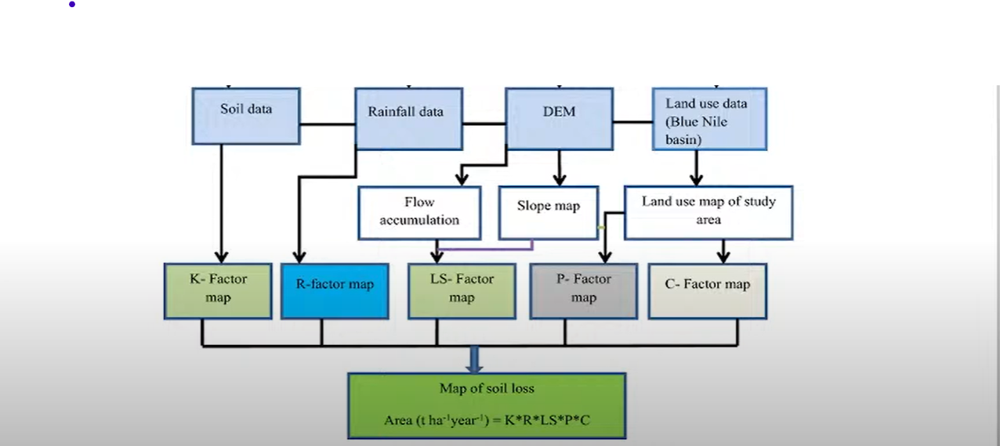

# 🌱 Soil Erosion Estimation Using USLE in QGIS  
### Case Study: Kakamega County, Kenya

This project applies the **Universal Soil Loss Equation (USLE)** model within **QGIS** to estimate soil erosion in **Kakamega County**, Kenya. It integrates factors such as rainfall, topography, soil type, land cover, and land management practices to identify erosion-prone areas and guide sustainable conservation strategies.

---

## 📍 Study Area

- **Location**: Kakamega County, Kenya  
- **Coordinates**: Approx. 0.2827°N, 34.7519°E  
- **Description**: Kakamega County lies in western Kenya, characterized by a mix of forested highlands and intensively cultivated lowlands, making it susceptible to soil erosion.

---

## 🎯 Project Objective

To assess soil erosion risk using the **USLE** model in **QGIS**, and generate geospatial insights that support data-driven soil conservation and land management interventions.

---

## 🧮 USLE Model Equation

> **A = R × K × LS × C × P**

Where:  
- **A**: Estimated average annual soil loss (tonnes/ha/year)  
- **R**: Rainfall erosivity factor  
- **K**: Soil erodibility factor  
- **LS**: Topographic factor (slope length and steepness)  
- **C**: Cover-management factor  
- **P**: Support practices (conservation) factor  

---

## 🛠️ Tools & Software

- **QGIS 3.x**  
- **Processing Toolbox**: Raster Calculator, SAGA GIS tools, GDAL  
- **GRASS Plugin**: For slope and LS factor calculations  

---

## 🧪 Methodology

> A step-by-step methodology will be shared in detailed PDF documentation. It includes:  
1. Data collection and preprocessing  
2. Derivation of each USLE factor (R, K, LS, C, P)  
3. Raster computation using QGIS tools  
4. Classification and interpretation of erosion risk  

---

## 📊 Outputs

- Soil loss raster map (`A`)  
- Thematic erosion risk zones (e.g., low, moderate, high, severe)  
- Statistical summary of erosion by land use/cover  

---

## 📚 References

- Wischmeier, W.H. & Smith, D.D. (1978). *Predicting Rainfall Erosion Losses*  
- Panagos, P. et al. (2015). *The Global Rainfall Erosivity Database (GloREDa)*  
- FAO Reports and the RUSLE Guidebook  

---

## 📄 License

This project is licensed under the **MIT License**.  
You are free to **use**, **modify**, and **distribute** the content with proper attribution.

---

## 🤝 Contributions

We welcome contributions to improve this project! You can:  
- Fork the repository  
- Report bugs or suggest improvements  
- Submit pull requests  

